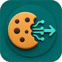

<div align="center">

# Cookie Extractor

<p align="center">
  
</p>

> *「把 Cookie 取出来，剩下的交给你」*

[](LICENSE)
[](https://developer.chrome.com/docs/extensions/mv3/)
[](#隐私说明)

<br>

**一键读取当前站点 Cookie，复制为 Header 或 JSON**

<br>

[效果演示](#效果演示) · [安装](#安装) · [使用](#使用) · [隐私说明](#隐私说明) · [背后的故事](#背后的故事)

<br>

</div>

---

## 效果演示

**打开插件，点击一次，Cookie 即刻到手。**

进入任意网站后，点击浏览器工具栏里的 Cookie Extractor 图标：

| 操作 | 效果 |
|------|------|
| Read Cookies | 读取当前站点可访问的 Cookie |
| Copy as Header | 复制为 `name=value; name2=value2`，可直接放入 HTTP 请求头 |
| Copy as JSON | 复制结构化 JSON，包含 domain、path、flags、过期时间等字段 |

JSON 输出示例：

```json
{
  "sourceUrl": "https://example.com",
  "exportedAt": "2026-04-26T12:00:00.000Z",
  "cookies": [
    {
      "name": "session_id",
      "value": "abc123...",
      "domain": ".example.com",
      "path": "/",
      "secure": true,
      "httpOnly": true,
      "sameSite": "Lax",
      "expirationDate": 1745673600
    }
  ]
}
```

界面中会默认遮罩 Cookie Value，完整值只会在复制时进入剪贴板。

---

## 安装

### 开发者模式加载

1. 克隆仓库
   ```bash
   git clone https://github.com/Harryleft/cookie-extractor.git
   ```

2. 打开 Chrome，地址栏输入 `chrome://extensions/`

3. 开启右上角「**开发者模式**」

4. 点击「**加载已解压的扩展程序**」→ 选择本项目根目录

5. 浏览器工具栏出现 Cookie Extractor 图标即安装成功

---

## 使用

1. 打开需要读取 Cookie 的网站

2. 点击浏览器工具栏里的 Cookie Extractor 图标

3. 点击「**Read Cookies**」

4. 根据需要选择：
   - 「**Copy as Header**」：适合 curl、Postman、接口调试
   - 「**Copy as JSON**」：适合脚本处理、备份检查、结构化分析

---

## 隐私说明

Cookie Extractor 的定位很简单：**读取当前浏览器本地可访问的 Cookie，并复制到你的剪贴板。**

它不会：

- 上传 Cookie
- 请求第三方服务
- 记录历史数据
- 写入远程数据库

所有操作都发生在你的浏览器本地。

---

## 权限说明

| 权限 | 用途 |
|------|------|
| `cookies` | 读取当前站点 Cookie 数据 |
| `activeTab` | 获取当前标签页 URL |
| `clipboardWrite` | 将 Cookie 复制到剪贴板 |
| `<all_urls>` | 支持在不同网站读取 Cookie |

---

## 背后的故事

调接口、复现请求、排查登录态问题时，经常需要把浏览器里的 Cookie 拿出来。

手动打开 DevTools、翻 Application 面板、逐个复制，步骤太重；直接复制请求头，又常常混着一堆无关字段。

Cookie Extractor 想解决的就是这个小痛点：打开当前页面，点一下，拿到干净的 Cookie Header；需要结构化信息时，再切到 JSON。

它不是账号管理器，也不是云同步工具，只是一个尽量克制的小插件。

---

<div align="center">

MIT License © [Harryleft](https://github.com/Harryleft)

</div>
