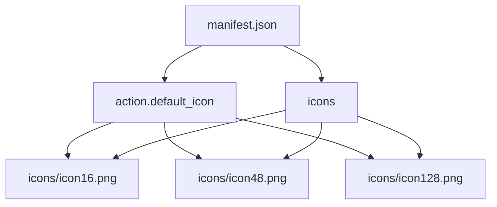
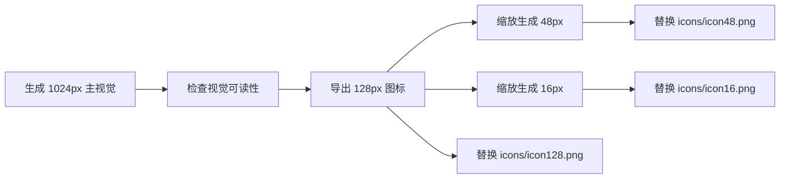

# Cookie Extractor Logo 替换分析

## 目标

为 Cookie Extractor 浏览器插件替换一套美观大方、适合小尺寸展示的品牌图标，并保持现有扩展结构不变。

## 当前结构

## 设计方向

- 使用清晰的 Cookie 轮廓作为识别核心，保证 16px 小尺寸仍可辨认。
- 融入“提取”含义，例如向外流动的数据线或简洁箭头。
- 采用与弹窗头部一致的青绿色调，形成应用内外一致的品牌感。
- 避免复杂文字，降低小图标渲染风险。

## 替换方案

## TODO List

- [ ] 生成无文字、适合浏览器扩展的方形 logo。
- [ ] 将生成图像导入项目工作区。
- [ ] 按 Chrome 扩展要求生成 16px、48px、128px 三个 PNG。
- [ ] 核对 `manifest.json` 的引用无需修改。
- [ ] 检查图片文件尺寸和 Git 差异范围。

## 边界情况

- 16px 图标不能依赖细碎纹理或小文字。
- 生成图像不能出现水印、品牌名称或误导性第三方标识。
- 若生成图像包含复杂背景，需要裁切为清晰居中的图标。
- 现有 `CLAUDE.md` 为未跟踪文件，本次不处理。
